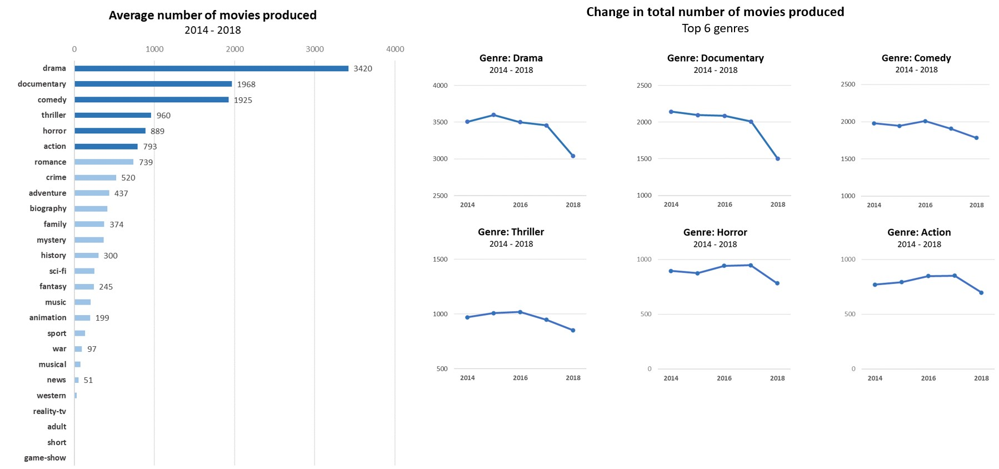
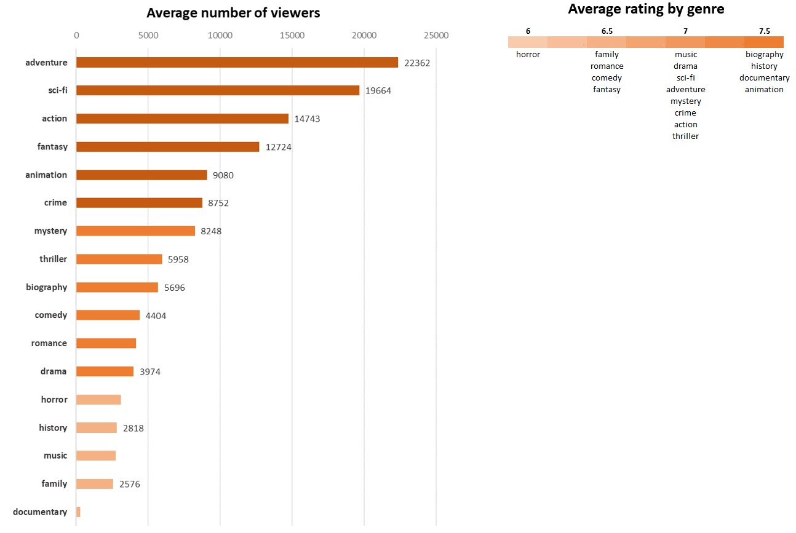
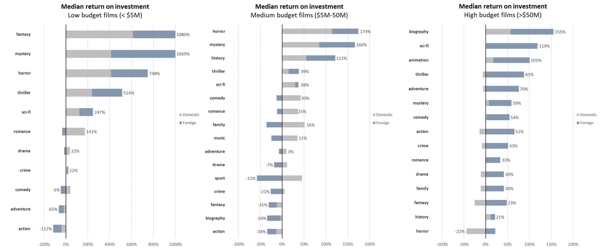

# Movie Analysis

**Author**: [Arina Ridha](https://www.linkedin.com/in/arina-ridha)

## Overview 

The aim of this analysis is to provide insight on opportunities for the movie studio (Microsoft) to pursue, in the context of basic film genres. Exploratory data analysis (EDA) were conducted on production frequency, viewer engagement, and profit by genre. Taking into account both engagement and profit, it is recommended for Microsoft to start by focusing on producing low budget films within the genres os sci-fi, thriller and mystery, and marketing these films domestically. Suggestions on further metrics to explore beyond film genres are presented; these suggested aspects should be considered when designing and implementing an optimal business strategy.

## Business problem

__[Researchers of Film Studies at Yale University](https://guides.library.yale.edu/c.php?g=295800&p=1975072)__ have identified that at least 40 genres exist within the medium of cinema. With such a large number, it's easy to be overwhelmed when trying to figure out the types of movies that seem to be performing the best. 

A quick online search of the 'Top 10 Best Movie Genres' seem to yield the usual suspects: **Action, Comedy, Drama, Sci-fi, Romance, Fantasy, Horror, Mystery, Animation** and **Thriller**. But which genres are the best of the best? This analysis attempts to tackle this question through three metrics:

1. **Frequency**: Which genres tend to be produced the most? 
2. **Engagement**: Which genres tend to have the highest viewership, and are rated the most favourably?
3. **Profit**: Which genres tend to bring in the highest return on investment (ROI)?

## Data sources

* **Internet Movie Database (IMDb)**: information on film titles, release dates, and genres
* **The Movie Database (TMDB)**: information on film titles, release dates, and genres 
* **Box Office Mojo (BOM)**: information on domestic and foreign box-office revenue
* **The Numbers (TN)**: information on production budgets, and domestic and worldwide box-office revenue

## Quantifying the three metrics

> Note: Analyses will be limited to the 26 __[basic genres](https://www.premiumbeat.com/blog/guide-to-basic-film-genres/#the-basic-film-genres)__  available via the data sources.

1. **Frequency**: Which genres tend to be produced the most? 

* The total number of movies produced by genre will be calculated for each year between the years 2014 - 2018
* The average number of movies produced per genre across the five year period will be calculated 
* A trend analysis will be conducted for the Top 6 genres produced.

2. **Engagement**: Which genres tend to have the highest viewership, and are rated the most favourably?

* Viewership will be estimated by the number of votes logged for each movie. The average number of viewers by genre will be calculated
* As movies will have a large range in terms of viewership even within genres, a weighted grand average rating will be calculated for each genre

3. **Profit**: Which genres tend to bring in the highest return on investment (ROI)?

* ROI is defined as `total revenue/production budget` 
* The median ROI will be calculated within both a domestic and a foreign scope
* Findings will be stratified by production budget category. Categories will be defined as per
__[this article](https://www.studiobinder.com/blog/production-budget/#:~:text=Blockbuster%20Movie%20Budgets&text=High%2Dbudget%20movies%20are%20almost,of%20more%20than%20%2450%20million.)__. Low: <%\\$5 million | Medium: \\$5 - \\$50 million | High: >\\$50 million 

> Note: Each movie record is associated with a maximum of three genres. For the purposes of the following analyses, each movie will count towards all genres that movie is categorised as.   *(e.g., 'Girls Trip' genres: Comedy, Drama; 'Girls Trip' will separately count as a Comedy movie and a Drama movie)*

## Methods

Please see [movie_analysis.ipynb](https://github.com/arinargh/movie-analysis/blob/main/movie_analysis.ipynb) for the full methodology.

## Analysis

### Frequency 

The six most produced film genres between the years 2014 - 2018 were (in descending order): 
1. Drama
2. Documentary
3. Comedy
4. Thriller
5. Horror
6. Action

Amongst this Top 6, **drama** films were the most frequently produced genre, sitting at an average of 3420 movies annually. This amount is almost double the number of films produced within the second- and third-highest genres (documentary and comedy, respectively).

In contrast, a negligible number of films (<100) were produced within the following genres:
1. Sport
2. War
3. Musical
4. News
5. Western
6. Reality-TV
7. Adult
8. Short
9. Game show

> Note: Due to their low numbers, these nine genres will be **excluded from all subsequent analyses.**

Based on the trend analysis for the Top 6 genres, the number of films produced across the years appear to be relatively consistent. However, there is a **noticeable drop** in 2018 - this could be accounted for by the __[financial crisis](https://edition.cnn.com/2018/12/31/investing/dow-stock-market-today/index.html#:~:text=2018%20was%20a%20record%2Dsetting,fell%20in%20the%20past%20decade.)__ experienced that year.

### Engagement

On average, adventure, sci-fi, action, fantasy, animation and crime films enjoy strong levels of viewership, with **adventure** topping this list of genres. 

On the other hand, horror, history, music, family and documentary films tend to have the lowest average number of viewers. This result is particularly interesting for **documentaries**, which was previously seen to be the 2nd most produced genre. It could be that people *are* watching these movies, but they just aren't logging their votes on IMDb (i.e., since viewership was quantified by the number of IMDb votes). 

The range of average ratings (out of ten) across the 17 genres analysed is fairly narrow at 6 - 7.5. Horror films tend to be the lowest rated, while **biographies, history films, documentaries and animation films were the highest rated**. 

### Profit 

> Note: Stratification by budget category limited the number of movie records per genre, with some genres having too few records for proper analysis.   For each budget category, genres with a number of record <=the 25th percentile were **removed to avoid skewing results.**

Total number of genres assessed per budget category: 
- Low budget: 11
- Medium budget: 16
- High budget: 15

Based on the insights into overall viewer engagement alone, action, adventure and crime movies may be good to pursue making, given both high viewership and high ratings. However for all three of these genres, the **median return on investment (ROI) appears poor - with numbers even running into the negative -** at least within the context of low and medium budget film categories (Although even within the high budget category, adventure was the only genre from this list that made the Top 5).

Horror films feature a strong ROI within the low and medium budget categories, though viewer engagement within this genre was previously seen to be poor. The fantasy and biography genres, while having good overall viewer engagement, appear to fall short in the profit sector for medium budget films. 

The genres that *do* appear to strike a balance between good engagement and high profit (across all budget categories) are **sci-fi, thriller, mystery, and animation.** No data on animated films were available for the low and medium budget categories, which is understandable given the __[high financial demands associated with producing high-quality animations](https://mowe.studio/how-much-does-animation-cost-vs-live-action/)__.

## Conclusions

Three business recommendations based on the above findings: 
1. **Start narrow**. Focus on a narrow range of the following high-performing basic genres: sci-fi, thriller, and mystery. Staying relatively consistent with the film genres produced is also a good way for a movie studio to build a reputation, both within the industry and amongst viewers (e.g., __[A24](https://movieweb.com/a24-pioneer-in-modern-horror/#:~:text=In%20addition%20to%20these%20Aster,been%20pioneering%20in%20modern%20horror.)__.).

2. **Start small**. In terms of production budgets, not ideas. Independent (i.e., indie) films frequenty require smaller budgets. __[Having a small budget doesn't restrict a movie from being a box-office hit](https://collider.com/movies-with-smallest-budgets/)__.

3. **Start local**. There are __[a lot of factors](https://www.superbusinessmanager.com/how-is-international-marketing-different-from-domestic-marketing/)__ to consider when marketing a movie internationally vs. domestically, with finances being just one of them. The three identified genres appear to perform as well in the domestic market as they do in the international market. 

Animation could be an additional genre to focus on once Microsoft's film studio becomes more established. And of course, shifting to higher production budgets and expanding into foreign markets.

### Next steps

It's worth considering the following questions on aspects beyond film genres: 
1. **Marketing strategies**: What are the demographics of avid movie-goers (e.g., age, gender)? Which forms of marketing may work best for these target demographics? 

2. **Talent**: Who's in demand within the industry, in the context of both those in front of and behind (e.g., screenwriters, sound designers) the camera? Who are the up and coming talent? 

3. **Competition**: It's to be expected that movie studios will release certain films during peak periods (e.g., action movies in summer, horror movies in October). How would a smaller studio fare if it released a movie around the same time as - and of a similar genre to - a much larger studio? Would the smaller studio run the risk of being overshadowed? 
